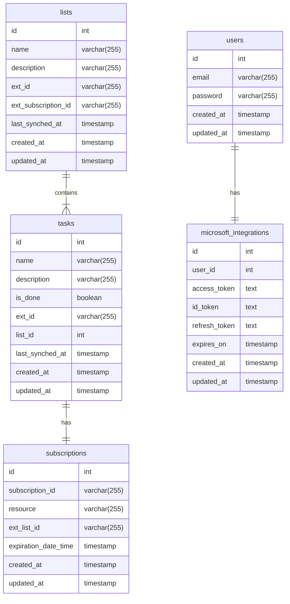

# To Do management service

A GraphQL API for managing To Dos and synchronizing them with Microsoft To Do API


## Table of Contents

- [Features](#features)
- [Tech](#tech)
- [Installation](#installation)
- [Running the project](#running-the-project)
- [Configuring the integration with the Microsoft To Do API](#configuring-the-integration-with-the-microsoft-to-do-api)
- [Way of working](#way-of-working)
- [Integration tests](#integration-tests)
- [Database](#database)
- [Synchronization](#synchronization)
  - [Webhook](#webhook)
  - [GraphQL Subscription](#graphql-subscription)
  - [Manual synchronization](#manual-synchronization)
  - [Cron job](#cron-job)
- [More documentation](#more-documentation)
  - [Compodoc](#compodoc)
  - [Postman collection](#postman-collection)
  - [GraphQL Playground](#graphql-playground)
- [Known limitations](#known-limitations)

## Features

- Possibility to query tasks
  - Query tasks that are not done
  - Tasks can be grouped in lists
- Possibility to add a task
- Possibility to update tasks
  - Possibility to mark tasks as done
- Integration with Microsoft To Do. Tasks are kept in sync between our service and the third-party integration
  - Tasks created in the third-party integration are always created in our service
  - The status of tasks is always in sync between our service and the integration

## Tech

- PostgreSQL
- Redis
- Docker
- TypeScript
- NestJS
- Express
- GraphQL

## Installation

```bash
$ npm install
```

## Running the project

1) Copy the .sample.env file to .env and fill in the Microsoft To Do API integration values.

2) Add to MICROSOFT_GRAPH_WEBHOOK_URL the address where the Microsoft To Do API will be able to find the webhook it will need to call to deliver the updates. In my case I have a free domain on [ngrok](https://ngrok.com/), so after starting the API I run the following to make it available:

```bash
$ ngrok http --domain=close-wrongly-jaybird.ngrok-free.app 3000
```

Ps: Webhook is only one of the ways that our project synchronizes with the Microsoft To Do. The API should also work without it.

3) Run the containers for the DB and Redis

```bash
$ docker compose -f ./resources/docker-compose.yml up
```

This command will automatically create the DB and required tables.

4) Run the API with one of the following commands

```bash
# development
$ npm start

# watch mode
$ npm run start:dev

# debug mode
$ npm run start:debug

# production mode
$ npm run start:prod
```

## Configuring the integration with the Microsoft To Do API

Since there's no client-side part connecting to our yet, the OAuth flow has been simplified without any page interaction.

After running the API successfully with the correct .env values:

1) Open [http://localhost:3000/microsoft/auth/signin](http://localhost:3000/microsoft/auth/signin) on your browser. This will redirect you to the authorization page from Microsoft after signing in.


2) The redirect url is configured to [http://localhost:3000/microsoft/auth/redirect](http://localhost:3000/microsoft/auth/redirect) in Azure (app config), so after you accept the permission, you'll be redirected to the redirect endpoint. The MSIdentity controller will then use the code it received, request tokens and save them to the microsoft_integrations table.

3) That's it! After the previous step, our API is able to sync with the Microsoft To Do API.

## Integration tests

First the Docker containers need to be running and then you can run the integration tests like so:

```bash
$ npm run test:integration
```

## Way of working

The [husky](https://www.npmjs.com/package/husky) lib is used for enforcing some rules for local development using Git hooks.

- On every commit:
  - The commit message is validated against [Conventional Commits](https://www.conventionalcommits.org/en/v1.0.0/)
  - The staged files are linted with several [eslint](https://www.npmjs.com/package/eslint) rules
- Before every push to the repository, the integration tests will run and should pass for the push to proceed.

More about way of working and release management can be found on [this post I wrote a while ago](https://jonathas.com/efficient-software-release-management-with-automated-changelog-generation/).

## Database

The diagram below is parsed via [mermaid](https://mermaid.js.org/syntax/entityRelationshipDiagram.html).

- The "ext" prefix in some of the fields refers to values that come from the Microsoft To Do API.
- A basic users table was created in order to keep track of the tokens, but no user authentication or handling is done at the moment.
- The subscriptions table was created so that when a list is created, a subscription for that list is created in the Microsoft To Do API. We need to create a subscription in order to be able to receive requests to our webhook which are related to tasks in a list. We keep track of it so that when a list is deleted, its related subscription is also deleted from the Microsoft To Do API.



## Synchronization

Our API synchronizes with the Microsoft To Do API in 3 ways: Webhook, manually and via a cron job

### Webhook

The Microsoft Graph API allows subscribing to task changes inside of lists, so whenever a list is created in our API, a subscription is created in the Microsoft Graph API to track changes to it.
In order for the webhook sync to work, a publicly accessible url for our API needs to be configured on .env and the integration set to true

```bash
MICROSOFT_GRAPH_USE_WEBHOOK=true
MICROSOFT_GRAPH_WEBHOOK_URL=https://close-wrongly-jaybird.ngrok-free.app/webhook
```

### GraphQL subscription

There's a ```notifications``` subscription available, which can be useful for client-side apps to know when some event happens. Every time a webhook request changes something in our DB, this change is pushed to the subscription


### Manual synchronization

It might happen that you created a task in the Microsoft To Do app but our API wasn't running at the time, or perhaps when you started the API you already had tasks in the app, so the manual synchronization allows for these changes to be synchronized to the DB.

You can run it by calling the ```startManualSync``` mutation.

### Cron job

A cron job can also be enabled in .env

```bash
USE_CRON=true
```

If enabled, it should run every minute and call the same method as the manual synchronization

## More documentation

## Compodoc

You can have a good overview about the project by running Compodoc:

```bash
$ npm run compodoc
```

This will generate a directory called "documentation" with several files, so you can open the index.html file on your browser.

## Postman collection

A [Postman](https://www.postman.com/downloads/) collection can be found inside of the docs directory. You can just import it to Postman and start using it with the API.

## GraphQL Playground

Another way of interacting with the API is with GraphQL Playground. You can access it by opening [http://localhost:3000/graphql](http://localhost:3000/graphql) on your browser.

## Known limitations

- There's no user management yet
- There's no user authentication yet
- Microsoft Graph API subscriptions are currently set to their [maximum length of subscription](https://learn.microsoft.com/en-us/graph/api/resources/subscription?view=graph-rest-1.0#maximum-length-of-subscription-per-resource-type) (4230 minutes) and there's no renewal mechanism.
