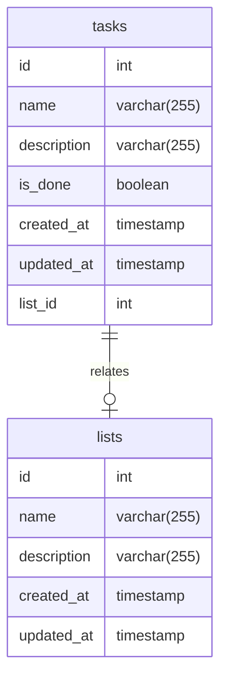

# To Do management service

A GraphQL API for managing To Dos and synchronizing them with Microsoft To Do API

## Features

- Possibility to query tasks
  - Query tasks that are not done
  - Tasks can be grouped in lists
- Possibility to add a task
- Possibility to update tasks
  - Possibility to mark tasks as done
- Integration with Microsoft To Do. Tasks are kept in sync between our service and the third-party integration
  - Tasks created in the third-party integration are always created in our service
  - The status of tasks is always in sync between our service and the integration

## Tech

- PostgreSQL
- TypeScript
- NestJS
- Express
- GraphQL

## Installation

```bash
$ npm install
```

## Running the app

```bash
# development
$ npm run start

# watch mode
$ npm run start:dev

# production mode
$ npm run start:prod
```

## Test

```bash
# unit tests
$ npm run test

# integration tests
$ npm run test:integration

# test coverage
$ npm run test:cov
```

## Database


